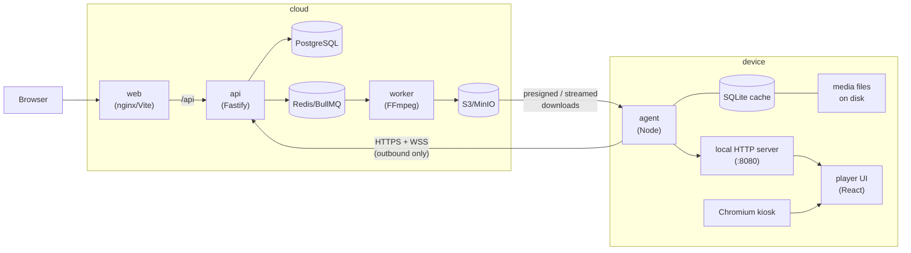

# Architecture

## System overview

Three deployable parts:

1. **Cloud backend** — `apps/api` (Fastify), `apps/worker` (BullMQ + FFmpeg),
   PostgreSQL (Prisma), Redis, S3-compatible object storage.
2. **Web dashboard** — `apps/web`, a React SPA talking to `/api/v1`.
3. **Device** — `apps/agent` + `apps/player`, installed on the device by
   `infra/device/install.sh`, run by systemd, displayed by Chromium in kiosk mode.

Shared logic lives in workspace packages so the server and the device cannot drift:

- `@signage/shared` — enums, DTOs, zod schemas, WebSocket message types.
- `@signage/scheduler` — the pure schedule-resolution engine. The API uses it for
  previews; the agent uses the same code to decide what plays right now.
- `@signage/sync-protocol` — the versioned manifest format and diffing.
- `@signage/media` — upload validation (magic bytes, mime checks) and probing helpers.

## Connectivity model

Devices only ever make **outbound** connections:

- `WSS /api/v1/device/ws` — persistent WebSocket for instant command delivery and
  sync notifications.
- HTTPS REST — pairing, heartbeats, sync manifests, media downloads, command
  acks/results, log/event upload.

If the WebSocket cannot connect (proxy, firewall), the agent degrades to polling
`GET /device/sync` and `GET /device/commands` on an interval. Commands are therefore
delivered at-least-once: the WS push is an optimization, the REST queue is the source
of truth, and every command must be acked and resolved with a result.

## Authentication and security

Two completely separate credential systems:

- **Users** — email/password (bcrypt) → JWT. Org membership carries a role:
  `owner > admin > editor > viewer`. Every `/orgs/:orgId/...` route checks the
  caller's role in that org; all queries are org-scoped; deletes are soft deletes.
  A user also has a platform-level `globalRole` (`user` | `superadmin`).
  **Superadmins** manage the platform itself — organizations, users, and
  memberships — via `/superadmin/*` routes; this is separate from org ownership.
  Accounts can be disabled (`disabledAt`) and forced to change password on first
  login (`mustChangePassword`); disabled users and disabled organizations are
  rejected at login and on `/auth/me`. **Public registration is disabled**
  (`POST /auth/register` → `410 Gone`): accounts are created by a superadmin (or
  an org admin within their org). Privileged and destructive actions are recorded
  in an append-only `AuditLog` (actor, action, target, metadata, IP) that never
  stores passwords.
- **Devices** — a pairing flow followed by a long-lived bearer token:
  1. Creating a screen in the dashboard generates a single-use pairing code
     (8 chars from an unambiguous alphabet, expiring).
  2. The device POSTs the code to `/device/pair` and receives a token
     (`sgd_` + 64 hex chars) exactly once.
  3. The server stores only the SHA-256 hash of the token. Comparisons are
     constant-time. Tokens can be revoked from the dashboard, which forces
     re-pairing with a fresh code.

Other measures: rate limits on login/change-password/pair, upload validation by magic
bytes (never trusting the client mime type), sanitized object names, media served
to devices only after device-token auth, and dashboard media URLs presigned with
short expiry.

### Multi-organization context (dashboard)

A user can belong to many organizations (`OrganizationMember`). `/auth/login` and
`/auth/me` return every organization the caller can see, each with the caller's
role and a presigned `logoUrl`. The dashboard keeps a single **active
organization** in an auth context (persisted in `localStorage` under
`signage.orgId`); all org-scoped pages and API calls use it, and switching orgs
remounts the page subtree so no stale data flashes.

- Regular users auto-select their (single or first) organization. With several,
  the sidebar **organization switcher** (logo, name, role) makes switching obvious.
  Users with none see a clear "not assigned to any organization" state.
- **Superadmins** default to **System / Superadmin context** (no active org): the
  `/superadmin/*` area is available and org-scoped navigation is hidden. They can
  open any organization from the switcher or the companies list, and return to
  system context at any time. Org-scoped pages render a guarded no-org state
  rather than blank, and a top-level error boundary keeps render errors from
  blanking the screen.

### Organization branding (logos)

Logos live in object storage (S3/MinIO) like media — only the storage key and
metadata (`logoStorageKey`, `logoMimeType`, `logoOriginalFilename`,
`logoSizeBytes`, `logoUpdatedAt`) are on the `Organization` row. Uploads accept
SVG/PNG/JPG/JPEG up to 2 MB, validated by content. SVGs are scanned and rejected
if scriptable or network-active (`<script>`, `on*` handlers, `javascript:`,
`<foreignObject>`, DOCTYPE/ENTITY, external refs); logos are only rendered via
``, never inlined, so they cannot execute script. Upload/delete requires
admin/owner (or superadmin). Delivery reuses presigned download URLs (≈24 h,
refreshed on each `/auth/me`).

## Media pipeline

1. Dashboard uploads a file → API validates (size, magic bytes), stores the original
   in S3, creates a `MediaAsset` with `processingStatus=pending`, enqueues a job.
2. Worker probes with ffprobe, generates processed variants and a thumbnail with
   FFmpeg, records width/height/duration/orientation/checksums, marks the asset
   `ready` (or `failed` with an error message; a reprocess endpoint re-enqueues).
3. Only `ready` media can be referenced in playlist sync manifests or emergency
   overrides.

## Scheduling

Schedules pick a playlist for a window: optional date range, optional weekly day
set, optional time-of-day window (overnight windows wrap past midnight), a priority
(0–1000), and targets (specific devices and/or device groups, or none). Resolution
order on a device at any instant:

1. Active **emergency override** (playlist or single looping media asset).
2. Highest-priority matching **schedule** (ties broken deterministically).
3. The device's **default playlist**.
4. Nothing scheduled → friendly status screen, never a blank screen.

Crucially, the _device_ computes this with `@signage/scheduler` against its cached
manifest and the local clock, so day/time transitions keep happening with zero
connectivity. Times are evaluated in the schedule's IANA timezone (falling back to
the device's), which makes DST transitions correct by construction.

## Device runtime

Two systemd units (see `infra/device/`):

- `signage-agent.service` — the Node agent. Responsibilities:
  - **Sync engine** — fetch manifest, diff against the SQLite cache index, download
    new media to temp files, verify SHA-256, rename into place, then commit the new
    manifest and cache rows in one SQLite transaction; only after the commit are
    stale files deleted. A failed download or checksum mismatch aborts the whole
    sync and the previous content keeps playing (see `docs/sync-protocol.md`).
  - **Local player server** — serves the player UI and cached media on
    `127.0.0.1:8080`, plus a state endpoint/stream the player UI follows.
  - **Command executor** — runs the 14 remote commands (restart player via
    systemctl, reboot via polkit-granted `login1`, screenshots via scrot,
    self-update via the release tarball script, etc.) and reports results.
  - **Telemetry** — heartbeats with system metrics, buffered logs and playback
    events (bounded ring buffers in SQLite so offline periods don't grow unbounded).
- `signage-player.service` — starts X and Chromium in kiosk mode pointed at the
  local player server. A wrapper script relaunches the browser if it dies and
  scrubs crash flags so no "restore pages?" bubble ever appears.

The player UI is intentionally dumb: it renders whatever state the agent computes
(items, durations, fit modes, status messages) and reports playback events back to
the agent. All decisions live in testable agent code.

**Display / fit modes.** Each player item carries resolved display settings —
`fitMode` (`contain`/`cover`/`stretch`/`original`/`scale_down`), a hex
`backgroundColor` and a `positionMode` (alignment). Precedence is item override →
playlist default → platform default (`contain`/`#000000`/`center`), computed by a
single shared resolver (`resolveDisplaySettings`) used identically by the backend
(manifest + resolved-preview) and the device, so display never diverges and works
fully offline. The player maps fit modes to CSS `object-fit` (with `object-position`
/ flex alignment for natural-size modes) and paints the background behind the media;
fit applies to the post-rotation viewport so every content orientation and
mounting rotation behaves correctly without ever modifying the uploaded media.
Screen setup is two orthogonal axes: `orientation` (the content canvas shape —
landscape or portrait, used for content-matching and previews) and `rotation`
(0/90/180/270° software compensation for how the panel is physically mounted).
A native 9:16 panel is `portrait` + 0°; a 16:9 panel turned on its side to show
portrait content is `portrait` + 90°. A single source of truth (the
shared `FitMode`/`PositionMode` enums and resolver) keeps the dashboard preview,
backend and player consistent.

## Sync protocol

See [sync-protocol.md](sync-protocol.md). Summary: the server builds a per-device
`SyncManifest` (settings, emergency state, schedules, playlists, media with
checksums and download paths) stamped with a `protocolVersion` (now **2**) and a
content-hash `version`. Dynamic folder entries and priority-rule assignments are
resolved to concrete ready-media ids at build time, and the playlist's
`playbackOrderMode` is applied on-device, so folder/alphabetical/random/priority
playback all work fully offline. Devices skip work when the version is unchanged,
otherwise download/verify/apply transactionally and report `sync-status` back,
which the dashboard shows per screen (`never_synced | syncing | in_sync | error`).

## Data model

Prisma schema in `packages/database/prisma/schema.prisma` (PostgreSQL). Core
models: `User` (+ `globalRole`), `Organization` (+ `status`/plan/limits),
`OrganizationMember` (role), `Device`, `DeviceGroup`/`DeviceGroupMember`,
`PairingCode`, `MediaFolder`, `MediaAsset`/`MediaVariant`,
`Playlist`/`PlaylistItem`, `PlaylistPriorityRule`/`PlaylistPriorityRuleAssignment`,
`Schedule` (+ device/group targets), `EmergencyOverride` (+ targets),
`DeviceCommand`, `DeviceHeartbeat`, `DeviceLog`, `PlaybackEvent`,
`DeviceScreenshot`, `AuditLog`. Everything user-facing is org-scoped and
soft-deleted (`deletedAt`); device telemetry tables are append-only and pruned.

**v2 content model.** `MediaFolder` is a nestable, org-scoped logical grouping
(`parentFolderId`); media gains an optional `folderId`. Folders never move storage
objects, and playlists reference folders by id, so renames/moves don't break
content. A `PlaylistItem` is either a direct media item (`type = media`) or a
**dynamic folder entry** (`type = folder`, with include-subfolders and media-type/
orientation filters) that resolves to current folder contents at sync/preview
time. A playlist's `playbackOrderMode` selects manual / alphabetical / random /
random-with-priority playback; `PlaylistPriorityRule` (+ assignments) drives the
last mode. Folder/random/priority resolution is shared by the sync manifest
builder, the resolved-preview endpoint, and the device engine
(`@signage/shared` `PlaybackQueueEngine`) so server and device cannot drift.

## Development environment

`docker-compose.yml` runs the full cloud side plus an optional `mock-device`
profile — a containerized agent + player that pairs with a code and behaves like a
real screen at `http://localhost:8081`, so the whole loop (upload → playlist →
schedule → sync → playback → commands) can be exercised with no hardware.
