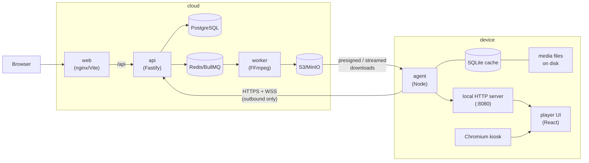

# Architecture

## System overview

Three deployable parts:

1. **Cloud backend** — `apps/api` (Fastify), `apps/worker` (BullMQ + FFmpeg),
   PostgreSQL (Prisma), Redis, S3-compatible object storage.
2. **Web dashboard** — `apps/web`, a React SPA talking to `/api/v1`.
3. **Device** — `apps/agent` + `apps/player`, installed on the device by
   `infra/device/install.sh`, run by systemd, displayed by Chromium in kiosk mode.

Shared logic lives in workspace packages so the server and the device cannot drift:

- `@signage/shared` — enums, DTOs, zod schemas, WebSocket message types.
- `@signage/scheduler` — the pure schedule-resolution engine. The API uses it for
  previews; the agent uses the same code to decide what plays right now.
- `@signage/sync-protocol` — the versioned manifest format and diffing.
- `@signage/media` — upload validation (magic bytes, mime checks) and probing helpers.

## Connectivity model

Devices only ever make **outbound** connections:

- `WSS /api/v1/device/ws` — persistent WebSocket for instant command delivery and
  sync notifications.
- HTTPS REST — pairing, heartbeats, sync manifests, media downloads, command
  acks/results, log/event upload.

If the WebSocket cannot connect (proxy, firewall), the agent degrades to polling
`GET /device/sync` and `GET /device/commands` on an interval. Commands are therefore
delivered at-least-once: the WS push is an optimization, the REST queue is the source
of truth, and every command must be acked and resolved with a result.

## Authentication and security

Two completely separate credential systems:

- **Users** — email/password (bcrypt) → JWT. Org membership carries a role:
  `owner > admin > editor > viewer`. Every `/orgs/:orgId/...` route checks the
  caller's role in that org; all queries are org-scoped; deletes are soft deletes.
- **Devices** — a pairing flow followed by a long-lived bearer token:
  1. Creating a screen in the dashboard generates a single-use pairing code
     (8 chars from an unambiguous alphabet, expiring).
  2. The device POSTs the code to `/device/pair` and receives a token
     (`sgd_` + 64 hex chars) exactly once.
  3. The server stores only the SHA-256 hash of the token. Comparisons are
     constant-time. Tokens can be revoked from the dashboard, which forces
     re-pairing with a fresh code.

Other measures: rate limits on register/login/pair, upload validation by magic
bytes (never trusting the client mime type), sanitized object names, media served
to devices only after device-token auth, and dashboard media URLs presigned with
short expiry.

## Media pipeline

1. Dashboard uploads a file → API validates (size, magic bytes), stores the original
   in S3, creates a `MediaAsset` with `processingStatus=pending`, enqueues a job.
2. Worker probes with ffprobe, generates processed variants and a thumbnail with
   FFmpeg, records width/height/duration/orientation/checksums, marks the asset
   `ready` (or `failed` with an error message; a reprocess endpoint re-enqueues).
3. Only `ready` media can be referenced in playlist sync manifests or emergency
   overrides.

## Scheduling

Schedules pick a playlist for a window: optional date range, optional weekly day
set, optional time-of-day window (overnight windows wrap past midnight), a priority
(0–1000), and targets (specific devices and/or device groups, or none). Resolution
order on a device at any instant:

1. Active **emergency override** (playlist or single looping media asset).
2. Highest-priority matching **schedule** (ties broken deterministically).
3. The device's **default playlist**.
4. Nothing scheduled → friendly status screen, never a blank screen.

Crucially, the _device_ computes this with `@signage/scheduler` against its cached
manifest and the local clock, so day/time transitions keep happening with zero
connectivity. Times are evaluated in the schedule's IANA timezone (falling back to
the device's), which makes DST transitions correct by construction.

## Device runtime

Two systemd units (see `infra/device/`):

- `signage-agent.service` — the Node agent. Responsibilities:
  - **Sync engine** — fetch manifest, diff against the SQLite cache index, download
    new media to temp files, verify SHA-256, rename into place, then commit the new
    manifest and cache rows in one SQLite transaction; only after the commit are
    stale files deleted. A failed download or checksum mismatch aborts the whole
    sync and the previous content keeps playing (see `docs/sync-protocol.md`).
  - **Local player server** — serves the player UI and cached media on
    `127.0.0.1:8080`, plus a state endpoint/stream the player UI follows.
  - **Command executor** — runs the 14 remote commands (restart player via
    systemctl, reboot via polkit-granted `login1`, screenshots via scrot,
    self-update via the release tarball script, etc.) and reports results.
  - **Telemetry** — heartbeats with system metrics, buffered logs and playback
    events (bounded ring buffers in SQLite so offline periods don't grow unbounded).
- `signage-player.service` — starts X and Chromium in kiosk mode pointed at the
  local player server. A wrapper script relaunches the browser if it dies and
  scrubs crash flags so no "restore pages?" bubble ever appears.

The player UI is intentionally dumb: it renders whatever state the agent computes
(items, durations, fit modes, status messages) and reports playback events back to
the agent. All decisions live in testable agent code.

## Sync protocol

See [sync-protocol.md](sync-protocol.md). Summary: the server builds a per-device
`SyncManifest` (settings, emergency state, schedules, playlists, media with
checksums and download paths) stamped with a `protocolVersion` and a content-hash
`version`. Devices skip work when the version is unchanged, otherwise download/
verify/apply transactionally and report `sync-status` back, which the dashboard
shows per screen (`never_synced | syncing | in_sync | error`).

## Data model

Prisma schema in `packages/database/prisma/schema.prisma` (PostgreSQL). Core
models: `User`, `Organization`, `OrganizationMember` (role), `Device`,
`DeviceGroup`/`DeviceGroupMember`, `PairingCode`, `MediaAsset`/`MediaVariant`,
`Playlist`/`PlaylistItem`, `Schedule` (+ device/group targets),
`EmergencyOverride` (+ targets), `DeviceCommand`, `DeviceHeartbeat`, `DeviceLog`,
`PlaybackEvent`, `DeviceScreenshot`. Everything user-facing is org-scoped and
soft-deleted (`deletedAt`); device telemetry tables are append-only and pruned.

## Development environment

`docker-compose.yml` runs the full cloud side plus an optional `mock-device`
profile — a containerized agent + player that pairs with a code and behaves like a
real screen at `http://localhost:8081`, so the whole loop (upload → playlist →
schedule → sync → playback → commands) can be exercised with no hardware.
