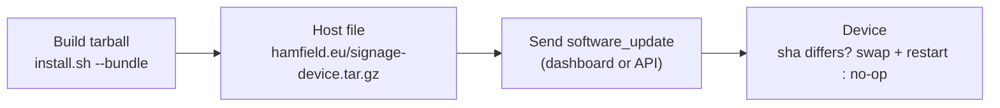

# Updating devices over the air

How to push a new agent + player build to deployed screens from a single hosted
file, using the dashboard `software_update` command. No SSH, no per-device
hands-on work.

For first-time install and the full config reference, see
[device-install.md](device-install.md).

## How it works

Each device has a self-update script (`/opt/signage/bin/update.sh`, run by the
`software_update` command) and a hardcoded `SIGNAGE_UPDATE_URL`. When you send
the command, the device:

1. downloads the release tarball from `SIGNAGE_UPDATE_URL`;
2. compares its `sha256` against the version it is already running
   (`/opt/signage/.update-sha`);
3. if unchanged, **stops here** — no swap, no restart (a cheap no-op);
4. otherwise keeps the current version as `*.previous` for rollback, swaps in
   `agent`/`player-ui`/`bin`, records the new hash, and restarts the agent.

Because step 2/3 makes the command **idempotent**, you can send it to every
screen at any time (even on a schedule) and only the devices whose hosted file
actually changed will act. Cutting a new release is just: overwrite the hosted
tarball, then send the command.



## One-time setup per device

Point the device at your hosted URL (the "hardcode" step). Do it at install time
or later over SSH / the `signage` CLI:

```bash
signage config set SIGNAGE_UPDATE_URL https://hamfield.eu/signage-device.tar.gz
```

This writes `SIGNAGE_UPDATE_URL` into `/etc/signage/agent.env` and restarts the
agent. `SIGNAGE_UPDATE_CMD` already defaults to `/opt/signage/bin/update.sh`, so
nothing else is needed. Verify with `signage config`.

## 1. Build the release tarball

On any machine with the repo checked out (your laptop, a CI runner — it does not
have to be a device):

```bash
git pull                                                  # get the code you want to ship
./infra/device/install.sh --bundle signage-device.tar.gz
```

`--bundle` builds the agent (with `node_modules`) and the player UI and packs
them into the layout the updater expects:

```
agent/        built agent
player-ui/    built player UI
bin/          helper scripts (update.sh, screenshot.sh, …)
```

It does **not** install anything locally — it only produces the tarball.

## 2. Host the tarball

Upload `signage-device.tar.gz` to a stable, publicly reachable HTTPS URL — the
same one you set in `SIGNAGE_UPDATE_URL`, e.g.
`https://hamfield.eu/signage-device.tar.gz`. Any static webhost works; the
device just does an HTTPS `GET`.

> **Watch out for caching.** The "only if newer" check relies on the device
> fetching the new bytes. If the URL sits behind a CDN/cache (e.g. Cloudflare),
> a stale cached copy will mask your new release. Either:
>
> - serve that path with `Cache-Control: no-cache` (or a very short TTL), or
> - purge the cache after each upload, or
> - version the filename (`signage-device-2026-06-23.tar.gz`) and update
>   `SIGNAGE_UPDATE_URL` on the devices to match.

Keep the URL stable if you can — then a release is a single file overwrite.

## 3. Send the update command

### From the dashboard (per screen)

Open the screen → **Commands** tab → **Software update** (confirm the prompt).
The command is pushed instantly over WebSocket when the device is connected, or
delivered on its next poll otherwise. Watch the command status go
`pending → sent → acked → completed` (or `failed` with the device's output).

There is no single fleet-wide button — send it per screen, or script it (below)
to cover many devices.

### From the API (whole fleet / automation)

The command endpoint is per device:

```
POST /api/v1/orgs/:orgId/devices/:deviceId/commands
Authorization: Bearer <user JWT>
Content-Type: application/json

{ "type": "software_update", "payload": {} }
```

Roll the whole fleet by looping over the org's devices:

```bash
ORG=org_…
TOKEN=…                                   # JWT from POST /api/v1/auth/login
BASE=https://signage.example.com/api/v1

curl -fsS -H "Authorization: Bearer $TOKEN" "$BASE/orgs/$ORG/devices" \
  | jq -r '.[].id' \
  | while read -r id; do
      curl -fsS -X POST \
        -H "Authorization: Bearer $TOKEN" -H 'Content-Type: application/json' \
        -d '{"type":"software_update","payload":{}}' \
        "$BASE/orgs/$ORG/devices/$id/commands" >/dev/null
      echo "queued update for $id"
    done
```

Because the device-side check is idempotent, running this against an unchanged
tarball is safe — only out-of-date screens swap + restart.

## Verifying & rolling back

- **Verify:** the command result shows `Update applied — restarting agent`, or
  `Already up to date — hosted release unchanged …` when nothing changed. After
  the restart, `signage version` (or the device's reported `appVersion` in the
  dashboard) reflects the new build.
- **Force a re-apply:** if a device is wedged on a bad swap, run
  `update.sh --force` locally (or temporarily change the hosted file) to bypass
  the hash check.
- **Roll back:** the previous build is kept as `/opt/signage/agent.previous` and
  `/opt/signage/player-ui.previous`. To revert, host the older tarball again and
  re-send the command, or restore the `*.previous` directories by hand and
  `signage restart`.

## Troubleshooting

| Symptom                                                  | Check                                                                                                  |
| -------------------------------------------------------- | ------------------------------------------------------------------------------------------------------ |
| `SIGNAGE_UPDATE_URL is not set`                          | `signage config` — set it (see one-time setup).                                                        |
| Command `failed`, download error                         | URL reachable over HTTPS from the device? `curl -fsSL "$SIGNAGE_UPDATE_URL" -o /tmp/t.tgz` on the box. |
| `Tarball does not look like a release`                   | Rebuild with `install.sh --bundle`; don't repackage by hand (it must contain `agent/dist`).            |
| Reports "already up to date" but you uploaded a new file | Stale CDN/cache — purge it or use `Cache-Control: no-cache` / a versioned filename.                    |
| Update applied but screen didn't change                  | `signage player-logs`; the player restarts a couple of seconds after the agent.                        |
